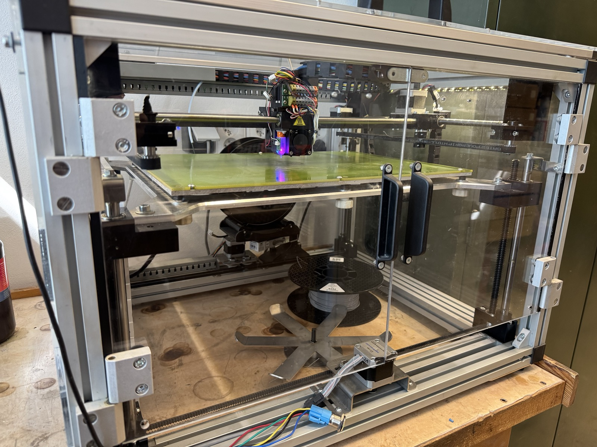
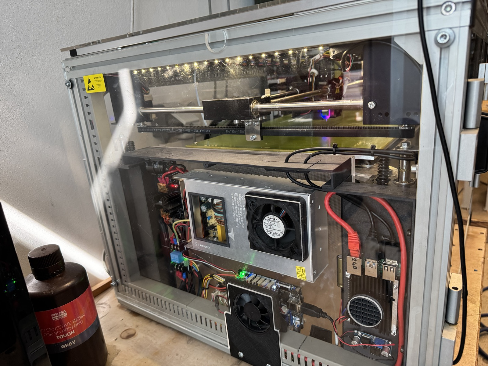
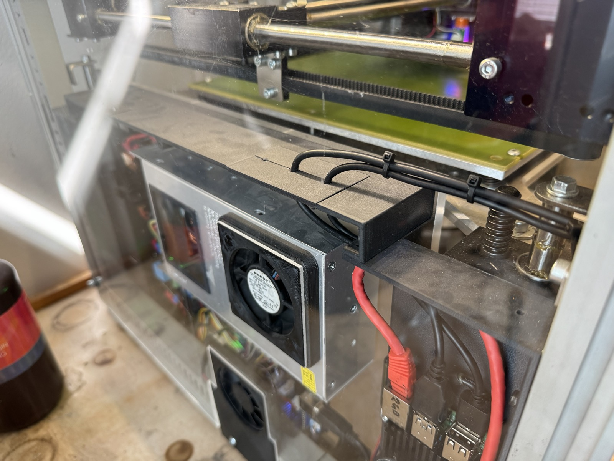
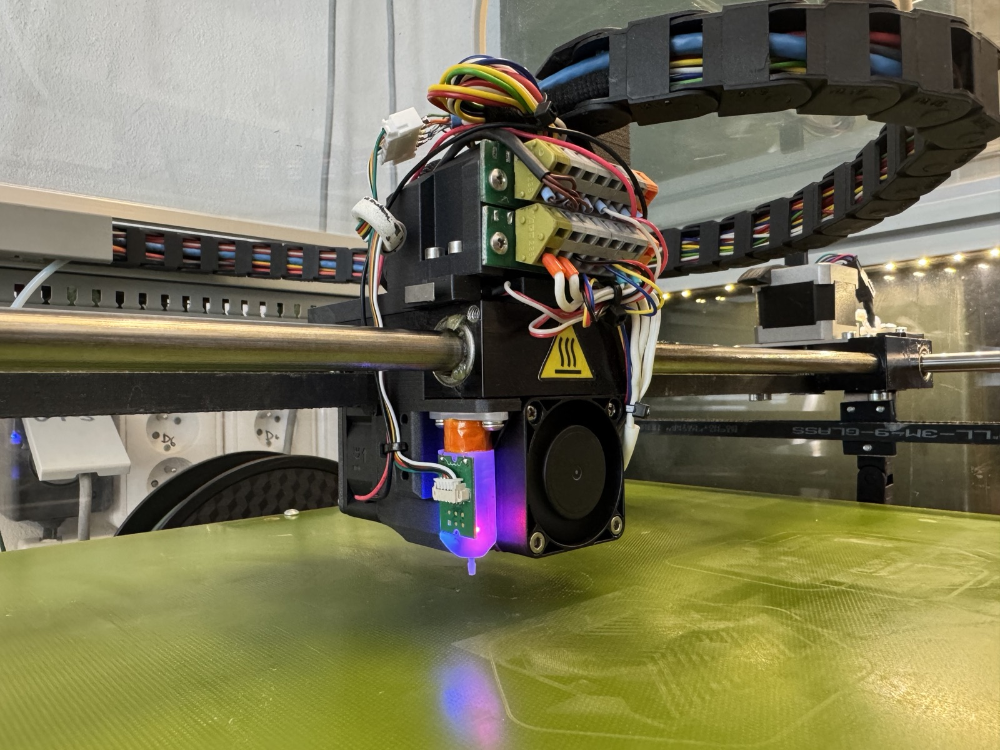

# 3D Factories Profi3DMaker — Klipper Conversion

A full conversion of the **3D Factories Profi3DMaker** — a closed-source commercial printer with no autoleveling, no web interface, and limited usability — into a modern, fully-featured Klipper-based machine.



---

## Why This Conversion?

The original Profi3DMaker had significant limitations out of the box:

- No automatic bed leveling
- No web-based control interface
- No input shaper / resonance compensation
- No exclude objects support
- No modern slicer profile support
- Proprietary, closed firmware with no community support

This project replaces the original control system entirely while keeping the robust aluminum extrusion frame and large build volume.

---

## Hardware Overview

| Component | Original | After Conversion |
|---|---|---|
| Control board | Proprietary | **Lerdge Z (STM32F407)** |
| Firmware | Closed proprietary | **Klipper** |
| Web interface | None | **Mainsail (Raspberry Pi 4 2GB)** |
| Extruder | Stock direct | **HGX direct drive extruder** |
| Bed leveling | Manual only | **BLTouch v3.4** |
| Probe (alt.) | None | **Klicky Probe v2** |
| Belts | Stock | **Stock** |
| Enclosure | Partial | **Full plexiglass panels** |
| Lighting | None | **LED strip** |
| Cable management | Hard cables | **Flexible silicone cables** |

---

## Build Volume

| Axis | Size |
|---|---|
| X | 400 mm |
| Y | 260 mm |
| Z | 190 mm |

---

## Electronics Bay

The bottom section of the frame houses all electronics: PSU, Lerdge Z board, and Raspberry Pi 3B — all neatly mounted and accessible.




---

## Print Head

The original print head was completely replaced with a custom-designed assembly modeled in **Autodesk Fusion 360**. It integrates:

- **HGX direct drive extruder** (Ideaformer BDE v1)
- **BLTouch v3.4** for automatic mesh bed leveling
- **Klicky Probe v2** as an alternative probe option
- Dual part cooling fans with custom duct
- Hotend fan
- Cable chain attachment



### Fusion 360 — Print Head Assembly

The full parametric model includes the carriage, extruder mount, fan ducts, probe holders, and belt tensioner:


---

## Custom Printed Parts & Enclosure Covers

Side and rear panels were designed in Fusion 360 as a enclosure system with 3D printed corner brackets, fan mounts, and vent covers.


---

## Repository Contents

```
3D-Maker/
├── config/
│   ├── printer.cfg          — Main Klipper configuration
│   ├── macros.cfg           — Custom macros (PRINT_START, PRINT_END, etc.)
│   └── moonraker.conf       — Moonraker / Mainsail config
├── stl/
│   └── bed_plate.stl        — Custom printed bed plate
├── orca_slicer/
│   └── MP_3DMaker_0_4_nozzle.orca_printer  — Full OrcaSlicer printer bundle
├── images/
│   ├── IMG_9366.jpg         — Printer overview
│   ├── IMG_9367.jpg         — Electronics bay
│   ├── IMG_9368.jpg         — Electronics detail
│   └── IMG_9369.jpg         — Print head close-up
│   ├── Snímek_obrazovky_2026-04-09_150134.png   — OrcaSlicer profile
│   ├── Snímek_obrazovky_2026-04-09_151301.png   — Enclosure CAD front
│   ├── Snímek_obrazovky_2026-04-09_151306.png   — Enclosure CAD rear
│   ├── Snímek_obrazovky_2026-04-09_151631.png   — Print head CAD front
│   ├── Snímek_obrazovky_2026-04-09_151637.png   — Print head CAD rear
│   ├── Snímek_obrazovky_2026-04-09_151726.png   — Print head CAD bottom
│   └── Snímek_obrazovky_2026-04-09_151839.png   — Print head CAD exploded
└── README.md
```

---

## OrcaSlicer Profile

A complete **OrcaSlicer printer bundle** (`.orca_printer`) is included with print macros.


**Printer:** MP 3DMaker — 0.4 mm nozzle  
**Build area:** 400 × 260 mm  
**Max height:** 190 mm

### Included Filament Profiles

| Filament | Notes |
|---|---|
| Generic PET | Template profile |
| Kingroon PLA | Standard PLA |
| PLA BODY SUNLU | Body/structural parts |
| PLA SATEN WHITE HS | High-speed satin PLA |
| PLA SATEN BLACK HS | High-speed satin PLA |
| PLA SILK GOLD / GREEN / RED | Silk PLA variants |
| PLABasic Alzament | Budget PLA |
| PETG Nebula | PETG for vases / fast prints |
| RecPET Magnesia Blue | Recycled PET |
| Prusament PCCF | Carbon-fibre reinforced PC |
| TPU 96A | Flexible filament |

### Included Process Profiles

| Profile | Layer height |
|---|---|
| 0.2 standard @for all | 0.2 mm — general purpose |
| 0.1 vase | 0.1 mm — vase / detail mode |
| 0.2mm PCCF Strength | 0.2 mm — tuned for PC-CF |

### How to Import

1. Open **OrcaSlicer**
2. Go to **File → Import → Import Configs**
3. Select `MP_3DMaker_0_4_nozzle.orca_printer`
4. All printer, filament, and process profiles will be imported at once

---

## Klipper Features Enabled

- ✅ Automatic mesh bed leveling (BLTouch)
- ✅ Web interface via Mainsail
- ✅ Input shaper / resonance compensation
- ✅ Exclude objects mid-print
- ✅ Pressure advance tuning
- ✅ Custom `PRINT_START` / `PRINT_END` macros
- ✅ Filament runout sensor support
- ✅ Real-time config editing without reflashing

---

## Control Board — Lerdge Z

The Lerdge Z board uses an **STM32F407** MCU. Klipper firmware must be compiled with the following settings:

- Micro-controller: **STM32F407**
- Bootloader offset: **32KiB**
- Clock reference: **25 MHz crystal**
- Communication: **UART on PA9/PA10**

Flash via original FW with attached display.

---

## Notes

- The original printer frame, rods, and leadscrews were reused
- The Raspberry Pi 4 runs Klipper host + Moonraker + Mainsail
- All custom structural parts were designed in **Autodesk Fusion 360**
- STL files are print-ready for 0.2mm layer height, 3 perimeters, 40% infill
